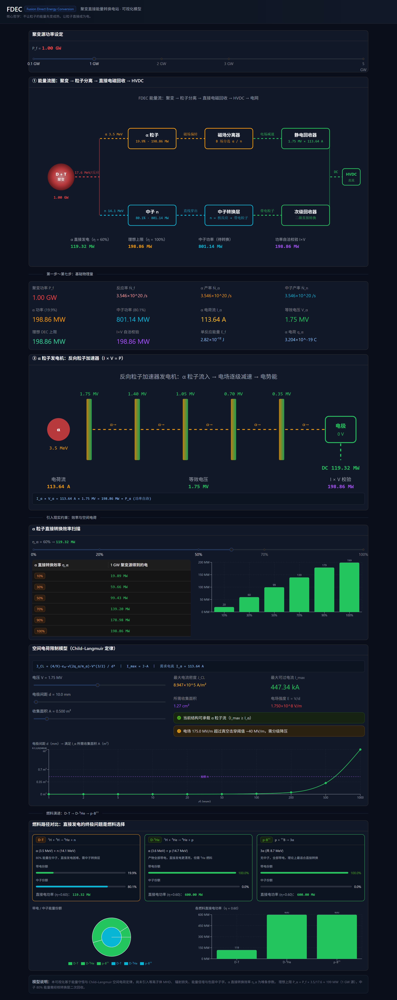

# FDEC — Fusion Direct Energy Conversion

> **聚变直接能量转换电站**
>
> 核心哲学：**不让粒子的能量先变成热。让粒子直接成为电。**

---

## 0. 概念一句话

> **聚变产生高能粒子 → 直接产生电势 → 高压直流 → 并网**
>
> 尽可能不经过"热 → 蒸汽 → 机械 → 电"。

---

## 1. 先把传统路线彻底拿掉

传统 D-T 聚变电站：

```text
D + T
  ↓
聚变
  ↓
14.1 MeV 中子 ─────→ 包层
                         ↓
                        热
                         ↓
                       蒸汽
                         ↓
                       汽轮机
                         ↓
                       发电机
                         ↓
                        电网

3.5 MeV α粒子
  ↓
加热等离子体
```

我们提出另外一种：

```text
                         ┌──────── α粒子 ────────┐
                         ↓                       ↓
D + T → 聚变 → 高能粒子 → 粒子分离 → 静电/电磁转换
                         ↑                       ↓
                         └──── 中子转换系统 ────┘
                                                 ↓
                                          高压直流 DC
                                                 ↓
                                             逆变器
                                                 ↓
                                               电网
```

这里最关键的变化是：

> **"发电机"不再是一个旋转机械。**

---

## 2. 第一核心模块：α粒子直接发电

D-T 反应产生：

$$
\alpha + n
$$

其中 α 粒子：

$$
E_\alpha = 3.5 \,\text{MeV}
$$

它带：

$$
q = +2e
$$

因此它天然就是一个**高速正电荷载体**。

我们可以把聚变反应区产生的 α 粒子看成：

> **3.5 MeV 的天然"高能电荷包"。**

---

## 3. 用磁场把 α 粒子"筛出来"

这里可以利用一个非常漂亮的物理性质：

- **中子不带电。**
- **α 粒子带电。**

所以磁场可以区别它们。

概念结构：

```text
                    聚变区
              ┌──────────────┐
              │  D + T       │
              │     ★        │
              └──────────────┘
                  ↙      ↘
                α          n
               ↙            ↘
          磁场弯曲          直线穿出
             ↘
              ↘
        α粒子能量回收区
```

中子直接穿过磁场，α 粒子轨迹发生弯曲。于是我们获得了：

> **"粒子分选器"。**

---

## 4. 第二核心模块：不要"吃掉"α粒子的能量

传统聚变堆：

> α 粒子 → 等离子体加热 → 最终变成热

我们则尝试：

> α 粒子 → 电场减速 → 电势能

这一步是整个概念最核心的地方。

假设一个 α 粒子具有 $3.5\,\text{MeV}$，它带 $+2e$。如果我们建立逐级电势：

```text
α →

+1.75 MV
     ↓
+1.0 MV
     ↓
+0.5 MV
     ↓
0 V
```

α 粒子不断被减速，它损失的动能进入电场。最终：

$$
E_{kin} \rightarrow E_{electric}
$$

于是：

> **粒子减速过程本身就是发电过程。**

---

## 5. 这其实非常像一个"反向粒子加速器"

粒子加速器：

```text
电能 → 电场 → 粒子获得能量 → 高速粒子
```

我们的设备：

```text
高速粒子 → 电场 → 粒子失去能量 → 电能
```

所以可以把它理解成：

> **"反向粒子加速器发电机"**

这是这个概念最漂亮的地方。

---

## 6. 但是有一个巨大的问题

如果直接把 α 粒子打到电极：

```text
α →→→→→ 金属电极
              ↓
             热
```

又回到了：粒子 → 热，那就失去了意义。

所以我们需要：**"无碰撞减速"**。

让 α 粒子主要通过**电场**损失能量，而不是撞击固体。

理想状态：

```text
α
 ↓
╲
 ╲
  ╲
   ╲
    ╲
     ↓
      电极

动能 → 电势能

而不是：

动能 → 材料 → 热
```

这就是工程难点之一。

---

## 7. 第三个模块：中子怎么办？

这里才是 D-T 方案最大的困难。

14.1 MeV 中子占聚变能量的大头。我们不能假装它不存在。

所以设计一个：**"中子 → 带电粒子转换层"**。

概念上：

```text
14.1 MeV n
      ↓
┌─────────────┐
│ 核反应转换层 │
└─────────────┘
      ↓
带电粒子
      ↓
电场
      ↓
电能
```

注意：这不是简单的"中子发电"，而是：

> **利用中子诱发核反应，把中子的能量重新包装成带电粒子。**

然后再利用直接能量转换器回收。

---

## 8. 这里可以出现一个非常有意思的循环

整个电站：

```text
                 D + T
                  ↓
                聚变
                  ↓
        ┌─────────┴─────────┐
        ↓                   ↓
      α粒子                中子
        ↓                   ↓
   磁场分离             转换层
        ↓                   ↓
   静电回收             带电粒子
        ↓                   ↓
        └─────────┬─────────┘
                  ↓
            直接能量转换
                  ↓
               DC电力
                  ↓
              DC/AC
                  ↓
                电网
```

理论上：

> **没有必要把所有能量都先变成热。**

---

## 9. 那么"发电机"到底是什么？

传统发电机：

```text
机械能 → 转子 → 磁场变化 → 线圈 → 电
```

我们的发电机：

```text
高能粒子 → 粒子轨迹 → 电场/磁场 → 电荷分离 → 高压电势 → DC
```

所以：

- **没有汽轮机**
- **没有转子**
- **没有传统发电机**
- **没有蒸汽**

至少在主能量转换链上可以做到。

---

## 10. 甚至可以做成"高压直流聚变电站"

这比交流输出更自然。因为粒子直接转换出来的天然形式就是：**DC**。

```text
聚变
 ↓
粒子直接转换
 ↓
±MV级高压DC
 ↓
DC/DC
 ↓
高压直流母线
 ↓
电网逆变器
 ↓
50Hz AC
```

这时候逆变器只是**电网接口**，而不是发电原理本身。

---

## 11. 四级能量回收

### 第一级 — α粒子直接能量转换

3.5 MeV → 高压电

### 第二级 — 中子核转换

14.1 MeV → 带电粒子 → 直接电

### 第三级 — 逃逸带电粒子回收

如果存在电子、次级离子、辐射产生的带电粒子，继续通过电磁场回收。

### 第四级 — 余热回收

剩余不可直接转换的能量：

```text
损失 → 热 → 低温余热系统
```

注意这里很重要：

> **我们不是要求"100%零热"。** 这是不现实的。
>
> 我们的目标应该是：**让"热"从主要能量转换方式，降级成最后的损失回收环节。**

---

## 12. 这时候效率应该怎么看？

不能简单说："直接转换效率 90%，所以电站 90% 效率。"

真实系统至少存在：

- 聚变等离子体损失
- α 粒子逃逸
- 中子逃逸
- 核转换损失
- 辐射损失
- 电场转换损失
- 空间电荷限制
- 电极损失
- 辐射屏蔽损失
- 功率电子损耗

所以真正应该研究的是**净电效率**：

$$
\eta_{net} = \frac{P_{electric,out} - P_{plant}}{P_{fusion}}
$$

而不是单独看某一个转换器效率。

---

## 13. 更大胆一点：改变聚变反应堆的形状

传统托卡马克：

```text
        ___________
      /             \
     /   等离子体    \
    |       ○        |
     \               /
      \_____________/
```

我们的概念可以更像：**"聚变反应区 + 粒子喷口 + 能量回收器"**。

```text
                α
                ↑
           ╭────┴────╮
           │         │
       α ← │ 聚变区  │ → α
           │         │
           ╰────┬────╯
                ↓
              中子

      ↓                ↓
  粒子回收器        粒子回收器
      ↓                ↓
      └───────┬────────┘
              ↓
             DC
```

这已经不太像传统意义上的"核电站"。更像：

> **"一个巨大的粒子能量转换器"。**

---

## 14. 关键事实：真正的瓶颈是中子

如果真正要实现 **D-T + 直接发电**，最大的瓶颈不是 α 粒子，**而是中子**。

因为：

$$
17.6\,\text{MeV} = 3.5\,\text{MeV} + 14.1\,\text{MeV}
$$

其中约：

$$
\frac{14.1}{17.6} \approx 80\%
$$

在中子上。

所以如果我们只能直接回收 α 粒子，理论上最多只直接触及约 20% 的聚变能量。

这意味着：

> 真正革命性的突破不是"α粒子直接发电"，
>
> 而是：**如何把 14.1 MeV 中子的能量也转换成可直接回收的电荷运动。**

---

## 15. 更值得研究的方向：改变燃料

如果允许改变燃料：D-T → D-³He → p-B¹¹

我们实际上是在改变：**"聚变产物的电荷结构"。**

目标越来越明确：

```text
D-T
  80% 中子 / 20% 带电
  → 直接发电困难

D-³He
  大部分带电粒子
  → 直接发电更漂亮

p-B¹¹
  3个α粒子，全部带电
  → 理论上非常适合直接转换
```

这就是为什么：

> **"直接聚变发电"的终极问题，很可能不是发电机，而是燃料选择。**

---

## 16. FDEC 的核心哲学

> **不让粒子的能量先变成热。**
>
> **让粒子直接成为电。**

---

## 17. 下一步：从概念进入定量模型

不要停在概念层。建立一个**简化物理模型**，回答几个硬问题：

1. **一个 1 GW 聚变功率的 D-T 反应堆，每秒到底产生多少 α 粒子和中子？**
2. **α 粒子如果用 1.75 MV 等效电势回收，每秒理论上能产生多少安培？**
3. **中子转换层需要多大的转换截面和厚度？**
4. **空间电荷会不会把这种"粒子发电机"直接卡死？**
5. **如果设计成同轴圆柱形电场，而不是平板电场，能不能降低空间电荷问题？**
6. **最后能不能得到一个定量化模型：**

$$
\boxed{
D + T \rightarrow \text{高能粒子} \rightarrow \text{电磁场能量回收} \rightarrow \text{HVDC} \rightarrow \text{电网}
}
$$

这一步就从"科幻概念"进入**真正的聚变能源工程推演**了。

---

## 可视化模型软件

本仓库包含一个交互式可视化模型（React + TypeScript + Ant Design + Recharts），
将上述物理模型具体可视化，可调节聚变功率、α 转换效率、空间电荷结构参数。

### 版本对比轮播

> 🔄 在浏览器打开 [`docs/showcase.html`](docs/showcase.html) 可查看 **V1 → V2 → V3 → V4 → V5 自动轮播 + V4/V5 并排对比**（支持键盘 ←/→ 切换，6 秒自动播放）。
>
> 在线访问（部署服务器）：http://192.168.2.3:8765/showcase.html

**V6 3D Particle Digital Twin**（当前版本，全页高清截图）：


> V6 新增：3D Boris Pusher（经典+相对论）/ 空间变化 E/B 场 / 粒子输运（Wall/Converter/Escape）/ Particle Lab 单粒子实验室 / Fate Map 多粒子命运统计 / 10 项 Benchmark Suite / Analytical vs Numerical 对比

<details>
<summary><b>V5 物理可信度验证</b>（全页截图，点击展开）</summary>


V5：守恒律审计 / Monte Carlo P10/P50/P90 / 置信度分级 / L0→L3 模型等级
</details>

<details>
<summary><b>V4 反应堆方案比较器</b>（全页截图，点击展开）</summary>


V4：反应数据库 / 能量账本 / 粒子账本 / Fuel×Geometry 优化矩阵
</details>

<details>
<summary><b>V3 物理引擎</b>（全页截图，点击展开）</summary>


V3：6项物理校验 / Operating Map / Boris粒子轨迹 / 核反应转换层 / 中子四参数链
</details>

<details>
<summary><b>V1 概念演示器</b>（初版全页截图，点击展开）</summary>



V1：能量流图 + 基础物理量 + α发电机 + 效率扫描 + 空间电荷 + 燃料对比
</details>

### 运行

```bash
npm install
npm run dev      # 开发服务器（Vite，自动选端口）
npm run build    # 生产构建到 dist/
npm run serve    # 轻量静态服务器托管 dist/（自动选端口，无需 Vite）
```

### 可视化模块

| 模块 | 对应物理模型 |
| --- | --- |
| 能量流图 | 1 GW → α(199 MW) + n(801 MW) → 分离 → 回收 → HVDC |
| 关键参数面板 | 反应率 Ṅ_f、α/中子产率、I_α、V_α、I×V 自洽校验 |
| α 粒子发电机 | 反向粒子加速器：113.64 A × 1.75 MV ≈ 199 MW |
| 效率扫描 | η_α 滑块 → P_α·η_α 实时计算与柱状图 |
| 空间电荷模型 | Child–Langmuir 定律 J_CL = (4/9)ε₀√(2q/m)·V^1.5/d² |
| 燃料路径对比 | D-T / D-³He / p-B¹¹ 带电份额与直接电功率 |
| 物理校验引擎 | 6 项自洽性判定：能量/电荷守恒、自持、空间电荷、中子转换、净正电 |
| Operating Map | 电压 × 间距参数扫描热力图，R_SC 边界查找 |
| 粒子轨迹 | Boris pusher 积分 α 粒子在 B 场中的回旋运动 |
| 核反应转换层 | P = 1 − exp(−nσx)，⁶Li/⁷Li/⁹Be/²³⁸U 材料选择 + 厚度扫描 |

### 技术栈

- React 18 + TypeScript (strict)
- Ant Design 5（深色主题）
- Recharts 2（图表）
- Vite 5（构建）

---

## 路线图

### V1 — 概念与基础物理
- [x] 概念定义（本文档）
- [x] 物理模型：粒子产率与电流估算
- [x] 空间电荷限制分析（Child–Langmuir）
- [x] 燃料路径对比（D-T / D-³He / p-B¹¹）

### V2 — 物理—工程两级仿真器
- [x] 物理可信度等级（Level 0 理论上限 / Level 1 转换器 / Level 2 净输出）
- [x] α 抽取率 vs 聚变自持约束（f_α · P_required · 最大允许抽取率）
- [x] α 粒子洛伦兹轨道（r_L = mv/qB，可调磁场 1–50 T）
- [x] 同轴圆柱电场 E(r) = V/(r·ln(b/a)) 与平板对比 + 电场风险分级
- [x] 中子转换层三参数（η_capture · η_transfer · η_DEC）
- [x] 净电效率 η_net 系统建模（厂用电分项 + P_net 可行性判定）

### V3 — 物理引擎与自洽性校验
- [x] 自持约束 M 因子（P_α,heat + P_ext vs P_loss，临界判定）
- [x] Boris pusher 粒子轨迹积分（F = q(E + v×B)，能量漂移检测）
- [x] 空间电荷 Operating Map（电压 × 间距参数扫描，R_SC 边界查找）
- [x] 核反应转换层 P = 1 − exp(−nσx)（⁶Li / ⁷Li / ⁹Be / ²³⁸U 材料库）
- [x] 中子四参数链（η_capture · η_conversion · η_extraction · η_DEC）
- [x] 6 项物理校验引擎（能量守恒 / 电荷守恒 / 自持 / 空间电荷 / 中子转换 / 净正电）

### V4 — 反应堆方案比较器
- [x] 反应数据库（D-T / D-D / D-³He / p-B¹¹，含副反应 + 辐射损失 + 点火温度）
- [x] 能量账本（全链守恒审计 + ERF/NETF 双指标 + DEC Advantage）
- [x] 粒子账本（N/s 产率追踪 + 电荷守恒校验）
- [x] 等离子体功率平衡（韧致辐射 + 回旋辐射 + 输运损失 + 自持判定）
- [x] 磁喷口模型（B 场粒子导向效率 + 回旋半径 + 偏转角）
- [x] 粒子排气（几何因子 + 捕获效率 + 距离扫描）
- [x] 反应堆几何（托卡马克 / 直线型 / 磁镜 / FRC）
- [x] Fuel × Geometry 二维优化矩阵（自动寻找 max P_net）

### V5 — 物理可信度与数字孪生验证层
- [x] 能量守恒审计（P_fusion = P_electric + P_loss + P_radiation + P_escape）
- [x] 电荷守恒审计（Q_in = Q_out，电荷回路闭合）
- [x] 粒子守恒审计（N_produced = N_captured + N_escaped + N_deposited）
- [x] 动量守恒审计（两体反应 p1=p2 + 三体反应能量均分）
- [x] Monte Carlo 不确定性分析（500 次采样，P10/P50/P90 + 可行性概率）
- [x] 置信度分级（HIGH/MEDIUM/LOW）+ 模型等级（L0 Concept → L3 Validated）

### V6 — 3D Particle Digital Twin
- [x] 3D Boris Pusher（经典 + 相对论双模式）
- [x] 空间变化 E/B 场（Uniform / Parallel Plate / Coaxial / 磁喷口解析模型）
- [x] 粒子输运（Wall 碰撞 / Converter 捕获 / Escape 判定）
- [x] Particle Lab 单粒子实验室（参数可调 + TRACE + 3D 轨迹 + Energy(t) + Analytical vs Numerical）
- [x] Particle Fate Map（多粒子命运统计 / 粒子捕获率 vs 能量捕获率）
- [x] 10 项 Benchmark Suite（V6-B01~B10，自动运行 + PASS/FAIL 判定）
- [x] 预设实验 Case A/B/C/D（无电场回旋 / E×B 漂移 / 磁喷口导向 / 同轴减速）

### 后续
- [ ] V7: 中子输运（OpenMC / DAGMC 对接）
- [ ] V8: 实验基准校验
- [ ] α 扩散与输运模型
- [ ] 等离子体 MHD 耦合

---

## 许可

概念文档，开放讨论。